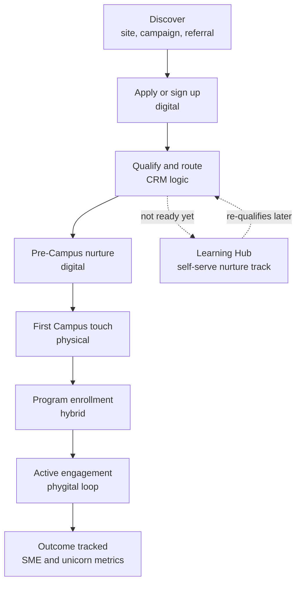

# Deep dive: the phygital onboarding flow

How a founder goes from finding DFHQ online to completing a flagship program, and how the digital platform should be built so nobody has to chase that journey by hand. This is the document I'd bring to the first cross-functional meeting with digital, program, and community teams. It's written as an operating spec, because the job is defining requirements clearly enough that a dev team can build against them without a second meeting.

---

## The problem in one line

Right now, most phygital platforms at this stage split ownership cleanly down the middle: the website owns sign-up, the program team owns the Campus experience, and nobody owns the handoff in between. That handoff is where founders go cold, where Learning Hub content gets built without knowing which program needs it this month, and where two hundred sign-ups quietly become twelve tracked SME outcomes.

The fix isn't a new form or a new page. It's treating the founder journey as one CRM-driven pipeline that happens to cross from digital into physical and back.

---

## The flow



Eight stages. Each needs a named system, a named owner, and a KPI. Without those three things it's a diagram, not an operation.

| Stage | What happens | System of record | Owner | KPI |
|---|---|---|---|---|
| **Discover** | Founder lands via organic, paid, partner referral, or event | Web analytics, UTM tagging | Digital Growth | Qualified sessions to applications started |
| **Apply or sign up** | Founder submits interest form for Academy, Traders, Learning Hub, or general | CMS form into CRM | Digital Growth | Form completion rate |
| **Qualify and route** | Auto-scored against program criteria, stage, sector, readiness, routed to the right track or to Learning Hub if not ready | CRM scoring rules | Digital Growth and Program Leads | Percent routed correctly on first pass |
| **Pre-Campus nurture** | Automated sequence: what to expect, prep material, booking the first Campus visit | CRM plus email or WhatsApp automation | Digital Growth | Booking rate from qualified to scheduled |
| **First Campus touch** | In-person visit, orientation, or first session | Campus check-in system, synced back to CRM | Community and Ops | Show-up rate vs. booked |
| **Program enrollment** | Formal enrollment in an Academy, Traders, or Learning Hub cohort | CRM program object | Program Leads | Booked visit to enrolled conversion |
| **Active engagement** | Sessions, mentorship, partner touchpoints, including Antler for Academy | Program delivery tools plus CRM activity log | Program Leads and Partners | Session attendance, milestone completion |
| **Outcome tracked** | Funding raised, revenue milestone, graduation, SME registration | CRM outcome object plus reporting layer | Digital Growth and Leadership reporting | Outcomes per cohort, tied to D33 targets |

Every stage gets one clear owner and one clear number. When leadership asks why Traders isn't converting, the answer is a dashboard, not a guess.

---

## The CRM logic doing the actual work

This is the automation layer. It turns "we hope people follow up" into "the system follows up, and humans handle the judgment calls."

**Qualify and route, triggered on form submit:**
```
IF applicant.program_interest == "Entrepreneur Academy"
   AND applicant.stage IN [idea, early-revenue]
   AND applicant.sector IN [Academy target sectors]
THEN route_to("Academy pipeline") + notify(Academy Program Lead)

IF applicant.readiness_score < threshold
THEN route_to("Learning Hub nurture track") + tag("re-qualify in 60 days")
```

**Pre-Campus nurture, time and behavior triggered:**
- Day 0: confirmation and what to expect
- Day 2: prep resource pulled from Learning Hub, matched to their track
- Day 5, if no booking yet: direct nudge to book
- No response after 14 days: hand off to a human, not another automated touch. This is where over-automating actively costs trust

**Post-Campus, triggered by the check-in event:**
- Same day: thank-you plus next-step CTA, enroll or next session
- If enrolled: added to the program's active engagement cadence
- If not enrolled within 7 days: routed to a human. A founder who showed up in person and didn't convert is a signal worth a real conversation, not another email

This is the same operating logic behind CareLine's after-hours intake, structured handoff instead of a missed call, and Ringpath's lead flow, qualified, booked, automatically re-engaged on any stall. Different vertical, same rule: a qualified person never goes quiet without either a next touch or an explicit human flag.

---

## Sample requirements doc: turning a business ask into something dev can build

This is the artifact that proves the "translate business needs into clear requirements" line in the job description. A stakeholder ask usually shows up like this:

> "We need more founders actually showing up to Campus after they sign up."

That's a symptom, not a requirement. Here's the version a dev team can actually build against:

**Business Requirement BR-014: Reduce sign-up-to-Campus-visit drop-off**

- **Problem:** Drop-off between application and first Campus visit is currently unmeasured, and anecdotally high.
- **Business outcome:** Increase booked-visit to show-up rate by a target percentage, measured on a rolling 30-day window.
- **In scope:** CRM tagging for booking source, automated pre-visit reminders at 48 hours and 2 hours out, post-no-show re-engagement flow.
- **Out of scope this phase:** Redesigning the application form itself. That's a separate requirement pending the month one audit findings.
- **Dependencies:** CRM must support conditional automation triggers. Campus check-in system must write back to CRM near real time.
- **Acceptance criteria:**
  1. Every booked visit carries a source tag and an automatic reminder sequence
  2. No-shows are flagged and routed to a human follow-up queue within 24 hours
  3. Show-up rate is visible on a live dashboard, broken out by program
- **Owner:** Digital Growth and Programs Manager for requirements and prioritization, working with the internal digital or dev team on the build and Program Leads on validation
- **Priority:** High. Directly blocks the month two CRM automation rollout.

This is the level of specificity that keeps a dev team from building the wrong thing, and keeps a program lead from being surprised by what shipped.

---

## KPIs that go in front of leadership

Not vanity metrics. Metrics that trace a straight line to D33:

- **Funnel:** discover, apply, qualify, book, show up, enroll, active, outcome, with conversion percentage at every step
- **Program health:** cohort completion rate, per program, Academy, Traders, Learning Hub
- **Content ROI:** which Learning Hub content actually correlates with progression to the next funnel stage, not pageviews
- **Pipeline to target:** enrolled founders and SMEs tracked against the 30-unicorn, 400-SME 2033 target, updated quarterly

---

## Why this matters more than a redesign

Nobody gets remembered for a prettier homepage. The person who owns this seam, and can prove with real numbers that fixing it moved more founders further into the pipeline, is the person leadership trusts with the next flagship program, and the one after that.
