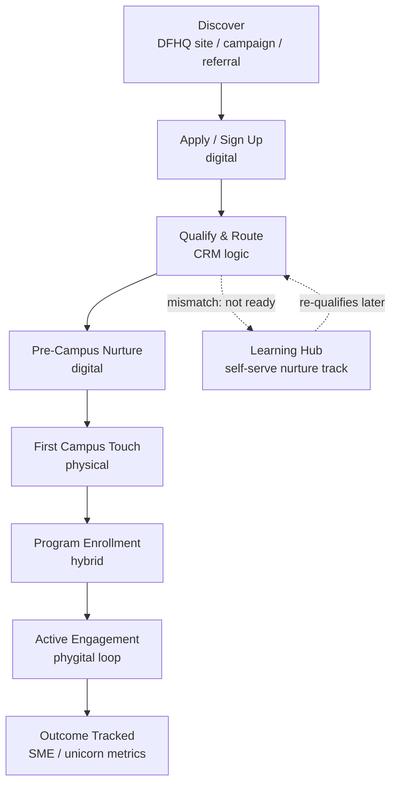

# Deep Dive: The Phygital Onboarding Flow

**How a founder goes from "found DFHQ on Google" to "completed a flagship program" — and how the digital platform should be built to make that happen without anyone manually chasing it.**

This is the document I'd bring to the first cross-functional meeting with digital, program, and community teams. It's written as a real operating spec, not a slide — because the job is defining requirements clearly enough that a dev team can build against them.

---

## The problem in one line

Right now, in most phygital platforms at this stage of maturity, the **website owns the sign-up** and the **program team owns the Campus experience**, and nobody owns the handoff between them. That handoff is where founders go cold, where Learning Hub content gets built without knowing which program needs it this month, and where "we had 200 sign-ups" never becomes "we produced 12 SME outcomes."

The fix isn't a redesign. It's treating the founder journey as one CRM-driven pipeline that happens to cross from digital into physical and back.

---

## The flow



Eight stages. Each one needs a named system, a named owner, and a KPI — otherwise it's a diagram, not an operation.

| Stage | What happens | System of record | Owner | KPI |
|---|---|---|---|---|
| **Discover** | Founder lands via organic, paid, partner referral, or event | Web analytics / UTM tagging | Digital Growth | Qualified sessions → applications started |
| **Apply / Sign Up** | Founder submits interest form (Academy, Traders, Learning Hub, general) | CMS form → CRM | Digital Growth | Form completion rate |
| **Qualify & Route** | Auto-scored against program criteria (stage, sector, readiness) and routed to the right track — or to Learning Hub if not yet ready | CRM (automated scoring rules) | Digital Growth + Program Leads | % routed correctly on first pass (no manual reshuffling) |
| **Pre-Campus Nurture** | Automated sequence: what to expect, prep material, first Campus visit booking | CRM + email/WhatsApp automation | Digital Growth | Booking rate from qualified → scheduled |
| **First Campus Touch** | In-person visit, orientation, or first session | Campus ops / check-in system, synced back to CRM | Community/Ops | Show-up rate vs. booked |
| **Program Enrollment** | Formal enrollment in Academy / Traders / Learning Hub cohort | CRM (program object) | Program Leads | Booked-visit → enrolled conversion |
| **Active Engagement** | Sessions, mentorship, partner touchpoints (e.g. Antler for Academy) | Program delivery tools + CRM activity log | Program Leads + Partners | Session attendance, milestone completion |
| **Outcome Tracked** | Funding raised, revenue milestone, graduation, SME registration | CRM (outcome object) + reporting layer | Digital Growth + Leadership reporting | Outcomes per cohort, tied to D33 targets |

The point of building it this way: **every stage has one clear owner and one clear number**, so when leadership asks "why isn't Traders converting," the answer is in a dashboard, not a guess.

---

## The CRM logic that actually does the work

This is the automation layer — the part that turns "we hope people follow up" into "the system follows up, humans handle judgment calls."

**Qualify & Route (auto-triggered on form submit):**
```
IF applicant.program_interest == "Entrepreneur Academy"
   AND applicant.stage IN [idea, early-revenue]
   AND applicant.sector IN [Academy target sectors]
THEN route_to("Academy pipeline") + notify(Academy Program Lead)

IF applicant.readiness_score < threshold
THEN route_to("Learning Hub nurture track") + tag("re-qualify in 60 days")
```

**Pre-Campus Nurture (time + behavior triggered):**
- Day 0: confirmation + what-to-expect
- Day 2: prep resource from Learning Hub relevant to their track
- Day 5 (if no booking yet): direct booking nudge
- No response after 14 days: hand off to human follow-up, not another automated touch — this is where over-automating actively costs trust

**Post-Campus (triggered by check-in event):**
- Same day: thank-you + next-step CTA (enroll / next session)
- If enrolled: added to program's active engagement cadence
- If not enrolled within 7 days: routed to a human — a founder who showed up in person and didn't convert is a signal worth a real conversation, not another email

This is the exact shape of automation I built for CareLine (after-hours intake → structured handoff) and for Ringpath (lead → qualified → booked, with automated re-engagement on stalls). Different vertical, same operating logic: **the system should never let a qualified person go quiet without either a next touch or an explicit human flag.**

---

## Sample requirements doc — turning a business ask into something dev can build

This is the artifact that proves the "translate business needs into clear requirements" part of the role. A stakeholder ask usually arrives like this:

> "We need more founders actually showing up to Campus after they sign up."

That's not a requirement — it's a symptom. Here's how I'd turn it into one:

**Business Requirement: BR-014 — Reduce sign-up-to-Campus-visit drop-off**

- **Problem:** Current drop-off between application and first Campus visit is unmeasured; anecdotally high.
- **Business outcome:** Increase booked-visit → show-up rate by a target %, measured over a rolling 30-day window.
- **In scope:** CRM tagging for booking source, automated pre-visit reminder sequence (48h + 2h before), post-no-show re-engagement flow.
- **Out of scope (this phase):** Redesigning the application form itself; that's a separate BR pending the Month 1 audit findings.
- **Dependencies:** CRM must support conditional automation triggers; Campus check-in system must write back to CRM in near-real-time.
- **Acceptance criteria:**
  1. Every booked visit has a source tag and a reminder sequence attached automatically
  2. No-shows are auto-flagged and routed to a human follow-up queue within 24 hours
  3. Show-up rate is visible on a live dashboard, broken out by program
- **Owner:** Digital Growth and Programs Manager (requirements + prioritization) working with internal digital/dev team (build) and Program Leads (validation)
- **Priority:** High — directly blocks Month 2 CRM automation rollout

This is the level of specificity that keeps a dev team from building the wrong thing and keeps a program lead from being surprised by what shipped.

---

## KPIs that go in front of leadership

Not vanity metrics. Metrics that trace a straight line to D33:

- **Funnel:** Discover → Apply → Qualify → Booked → Show-up → Enrolled → Active → Outcome, with conversion % at every step
- **Program health:** cohort completion rate, per program (Academy, Traders, Learning Hub)
- **Content ROI:** which Learning Hub content actually correlates with progression to the next funnel stage — not pageviews
- **Pipeline-to-target:** enrolled founders and SMEs tracked against the 30-unicorn / 400-SME 2033 target, updated quarterly

---

## Why this matters more than a redesign

Nobody gets remembered for a prettier homepage. The person who owns this seam — and can prove, with numbers, that fixing it moved founders further into the pipeline — is the person leadership trusts with the next flagship program, and the one after that.
